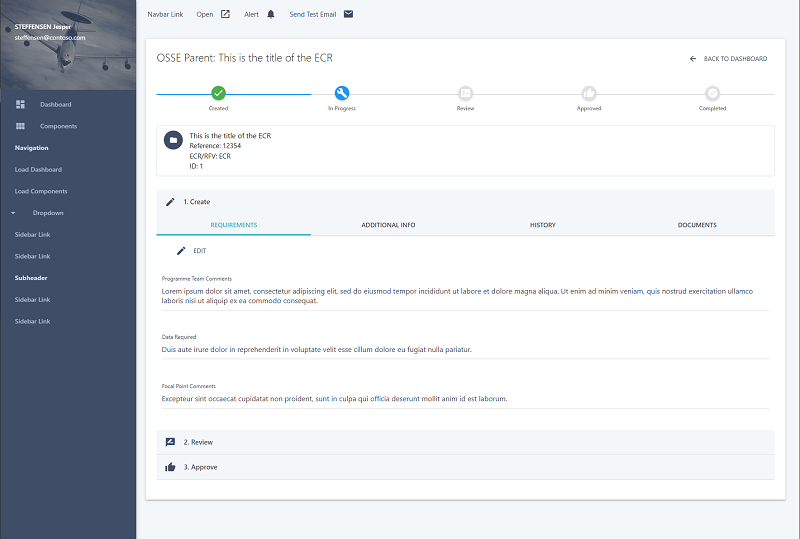

# OSSE Portal

A modern administrative dashboard portal built with MaterializeCSS. This project provides a ready-to-use admin template and dashboard using the Materialize CSS framework.

**Keywords**: materializecss admin, materialize admin template, materialize dashboard, material design admin, responsive admin template



## Technology Stack

- **Frontend Framework**: [MaterializeCSS](https://materializecss.com/) - A responsive front-end framework based on Material Design
- **JavaScript**: jQuery for DOM manipulation and AJAX requests
- **Routing**: Custom client-side router for template loading

## Features

- Responsive layout that works on desktop and mobile devices
- Client-side routing for seamless navigation between views
- Dashboard and components templates included
- Auto-initializes to dashboard view on page load
- Intelligent caching system for data and templates
- Offline-capable with fallback data for development

## Project Structure

- `SitePages/`
  - `App.html` - Main application entry point
- `SiteAssets/`
  - `templates/` - HTML templates
    - `dashboard-template.html` - Dashboard view template
    - `components-template.html` - UI components showcase
    - `parent-template.html` - Parent entity detail view
  - `js/` - JavaScript files
    - `init.js` - Application initialization and routing
    - `data-service.js` - SharePoint data API service
    - `cache-service.js` - Data and template caching service
    - `materialize.js` - MaterializeCSS core functionality
  - `css/` - Stylesheets
    - `style.css` - Custom application styles
    - `materialize.css` - MaterializeCSS styles
  - `FallbackData/` - JSON files for development/fallback use
    - `osseParentList.json` - Parent list data
    - `osseRequirementList.json` - Requirements list data
    - `currentUser.json` - Current user information
    - `siteUsers.json` - Site users information
  - `config.json` - Application configuration

## Application Loading Sequence

The OSSE Portal is designed to load efficiently in a specific sequence to ensure optimal performance. Here's the detailed loading flow:

```
┌─────────────────┐
│ 1. Load App.html│
└────────┬────────┘
         ▼
┌─────────────────┐
│ 2. Load CSS     │
│    Assets       │
└────────┬────────┘
         ▼
┌─────────────────┐
│ 3. Load JS      │
│    Libraries    │
└────────┬────────┘
         ▼
┌─────────────────┐
│ 4. Initialize   │
│    Cache Service│
└────────┬────────┘
         ▼
┌─────────────────┐
│ 5. Preload All  │
│    Data         │
└────────┬────────┘
         ▼
┌─────────────────┐
│ 6. Preload HTML │
│    Templates    │
└────────┬────────┘
         ▼
┌─────────────────┐
│ 7. Render       │
│    Initial View │
└─────────────────┘
```

### Detailed Loading Process

1. **Main HTML (`App.html`)**
   - Loads first, establishing the basic structure

2. **CSS and Assets**
   - Loads MaterializeCSS and custom styles
   - Loads fonts and icons

3. **JavaScript Libraries**
   - Loads in sequence: jQuery, MaterializeJS, Bluebird promises
   - Then loads our custom services: `data-service.js`, `cache-service.js`, `init.js`

4. **Cache Initialization**
   - `App.html:116` - Calls `cache.init()`
   - `cache-service.js:30` - The `init()` function initializes the cache
   - `cache-service.js:32` - Calls `data.init()` to load configuration first
   - `data-service.js:20` - Loads configuration settings from `config.json`

5. **Data Preloading**
   - `cache-service.js:33` - Calls `preloadEssentialData()`
   - `cache-service.js:45` - Gets request digest for API authentication
   - `cache-service.js:52-67` - Preloads all list data (OsseParentList, OsseRequirementList)
   - `cache-service.js:69-73` - Loads current user information
   - `cache-service.js:73-74` - Loads site users information
   - `cache-service.js:85-135` - Processes relationships between loaded data

6. **Template Preloading**
   - `cache-service.js:77-86` - Preloads all HTML templates from router configuration
   - Each template is stored with key `template:[path]` in `cache._store`
   - `cache-service.js:717-773` - The `loadTemplate()` function handles template caching
   - Templates are served from cache during navigation

7. **Initial Rendering**
   - `init.js:574-629` - Initializes routes and renders first view
   - `init.js:432-474` - The router's `loadTemplate()` function gets templates from cache
   - `init.js:457-463` - Initializes the appropriate view-specific function

All data is stored in the global `window.cache` object, with direct properties (like `cache.osseParentList`) for easy access, while templates are stored in the `cache._store` object with `template:` prefix keys.

## Getting Started

1. Clone this repository
2. Serve the project locally using Python's built-in HTTP server:
   ```bash
   # From the project root directory
   python -m http.server 3000
   ```
3. Open your browser and navigate to `http://localhost:3000`
4. Navigate between dashboard and component views using the sidebar

## Development

### Adding New Routes

Add new routes by extending the router configuration in `SiteAssets/js/init.js`:

```javascript
routes: [
  {
    name: 'newRoute',
    path: '../SiteAssets/templates/new-template.html',
    init: 'initNewTemplate'
  }
]
```

### Adding New Lists

To add a new data source, update the `config.json` file:

```json
"lists": {
  "newList": {
    "name": "NewListName",
    "expand": "Author",
    "orderBy": "Priority asc",
    "fallbackFile": "../SiteAssets/FallbackData/newList.json"
  }
}
```

### Caching Custom Data

To manually cache custom data:

```javascript
// Cache data with a unique key
cache._store['customKey'] = myData;

// Retrieve cached data
const data = cache._store['customKey'];
```